## 一、Hadoop 2.x shell命令集群监控与管理

### 1.1、启动程序

1、在搭建好的hadoop平台下运行wordCount程序运行wordcount

```
hadoop jar /usr/local/hadoop/share/hadoop/mapreduce/hadoop-mapreduce-examples-2.7.3.jar wordcount /test/input.txt /output
```

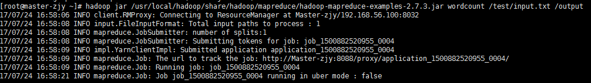

观察运行结果Yarn 端口：192.168.56.100:8088

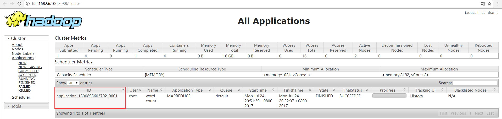

找到进程的ID为：application_1500895603702_0001

### 1.2、用户命令

1、yarn application [options]   Yarn应用程序。

```
yarn application -status application_1500895603702_0001  #打印程序的运行状态
```

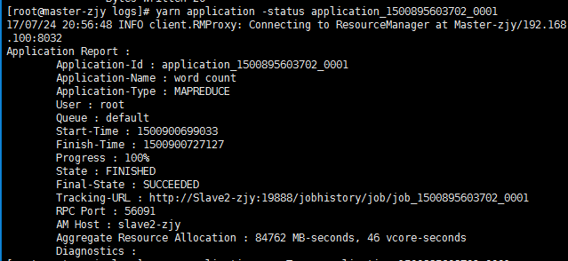

2、yarn applicationattempt [options]

3、yarn applicationattempt -list application_1500895603702_0001 // 列出给定的程序。

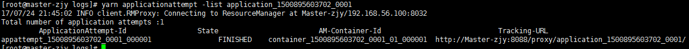

4、classpath 

Yarn classpath    //显示yarn路径

5、yarn container [options]   //yarn的容器

6、yarn logs -applicationId <application ID> [options]

7、yarn node [options]

```
yarn node -status Slave2-zjy:38563   #打印节点的状态
```

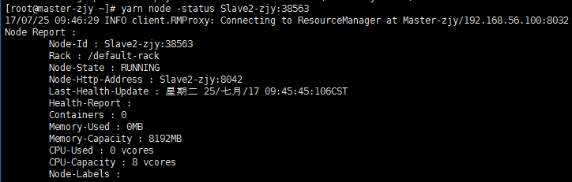

9、yarn queue [options]   //打印yarn的队列。

10、yarn version        //打印yarn的版本

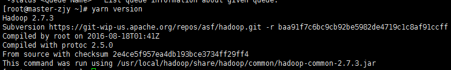

### 1.3、管理命令

1、daemonlog

```
yarn daemonlog  -getlevel 192.168.56.101:8088 datanode  #获取由守护程序中由限定类名称标识的日志的日志级别。
```

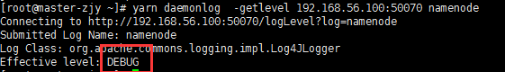

```
yarn daemonlog  -setlevel 192.168.56.101:8088 datanode DEBUG   #设置由守护程序中由限定类名称标识的日志的日志级别。
```

alert 必须马上采取行动的事件

crit 关键的事件

err 错误事件

warning警告事件

notice普通但重要的事件

info 有用的信息

debug 调试信息

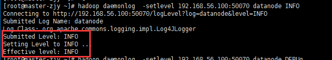

2、yarn nodemanager    //启动Node Manager

YARN是一个资源管理、任务调度的框架，主要包含三大模块：ResourceManager（RM）、NodeManager（NM）、ApplicationMaster（AM）。其中，ResourceManager负责所有资源的监控、分配和管理；ApplicationMaster负责每一个具体应用程序的调度和协调；NodeManager负责每一个节点的维护。对于所有的applications，RM拥有绝对的控制权和对资源的分配权。而每个AM则会和RM协商资源，同时和NodeManager通信来执行和监控task。几个模块之间的关系如图所示。

RM相当于学院，NM相当于辅导员，AM相当于班长，学院负责所有资源的监控、分配和管理，辅导员负责节点的维护管理，班长负责班里应用程序的调度和协调。

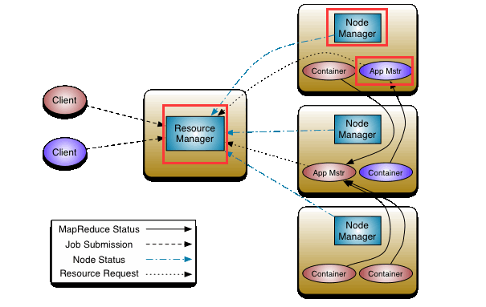

3、yarn proxyserver  启动web的代理服务器

4、Yarn timelineserver 启动yarn定时器。

5、sharedcachemanager运行共享缓存管理器。

6、rmadmin运行ResourceManager管理客户端

# 二、Hadoop 2.x管理REST API

通过查看REST API帮助文档学习。Hadoop YARN的web服务 REST API是一组访问集群、节点，应用程序和应用历史信息,提供访问的URI资源，该URI资源被分组为基于返回的信息的类型的API。一些URI资源返回集合而另一些返回单个信息。

curl --compressed -H "Accept: application/json" -X GET "http://192.168.56.100:8088/ws/v1/cluster/apps/application_1500944980652_0001"在xshell下是默认是JSON格式，所以我们要将其转换为xml格式。

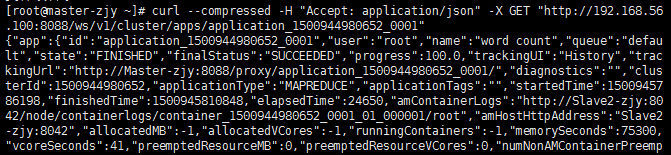

<http://www.bejson.com/>   使用JSon校验格式工厂对其进行转换。

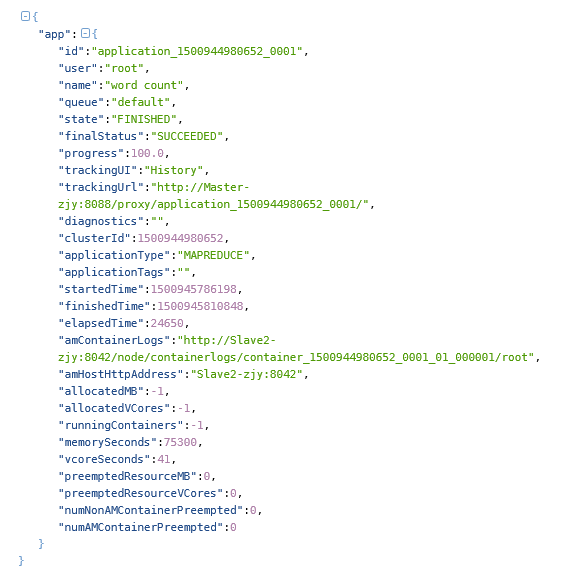

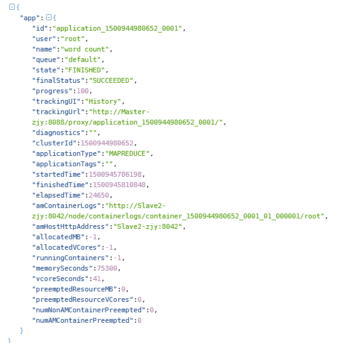

通过对xml的读取，我们得到URI资源返回集合信息，其基本包括的信息，程序id，角色名字，运行的程序名字，完成状态，执行的节点等基本信息。

