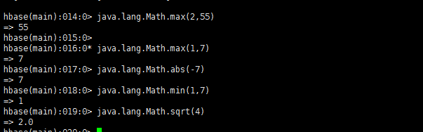

## 一、HBase Shell增删改查数据

Hbase是一个高可靠性、高性能、面向列、可伸缩的分布式存储系统，利用hadoop的hdfs作为文件存储系统，利用mapreduce处理hbase的海量数据，利用Zookeeper作为协调工具。其使用存储在大量的数据（TB级）。Hbase的物理模型Table在行的方向分割为多个Region,一个region由[startkey,endkey]表示，是Hbase中分布式存储和负载均衡的最小单位，同一个region在同一个服务器上。

 

### 1.1、Hbase表的结构


 

 HBase是一个面向列的数据库，在表中它由行排序。表模式定义只能列族，也就是键值对。一个表有多个列族以及每一个列族可以有任意数量的列。后续列的值连续地存储在磁盘上。表中的每个单元格值都具有时间戳。总之，在一个HBase：

​    表是行的集合。

​    行是列族的集合。

​    列族是列的集合。

​    列是键值对的集合。

HBase以表的形式存储数据,表有行和列组成。

row key为行键，用来检索记录的主键。

Column Family为列簇，Table在水平方向有一个或者多个Column Family组成，一个Column Family中可以包含任意多个Column。

Timestamp为时间戳， 每次数据操作对应的时间戳：可以看作是数据的版本号。 


### 1.2、创建表

| Row    key  | age     | course |      |
| ----------- | ------- | ------ | ---- |
| math        | english |        |      |
| zhaojinyang | 22      | 98     | 99   |
| zhaosan     | 22      | 90     | 91   |
| wangwu      | 21      | 90     | 91   |
| Row1        |         | 100    | 100  |

```
create 'student','age','course'
```

向表中插入数据

```
put 'student','zhaojinyang','age:','22'

put 'student','zhaojinyang','course:math','98'

put 'student','zhaojinyang','course:english','99'

put 'student','zhaosan','age:','22'

put 'student','zhaosan','course:math','90'

put 'student','zhaosan','course:english','91'

put 'student','wangwu','age:','21'

put 'student','wagnwu','course:math','90'

put 'student','wangwu','course:english','91'
```

可以验证是否已经创建，使用 list 命令如下所示


禁用表：

```
disable ‘student’
```

启用表：

```
enable ‘student’
```

要删除表或改变其设置，首先需要使用 disable 命令关闭表。使用 enable 命令，可以重新启用它。

很多操作需要先暂停表的可用性，比如上边说的alter操作，删除表也需要这个操作。disable_all和enable_all能够操作更多的表。

描述表：

```
describe ‘student'
```


验证表的存在

```
exists 'student'
```


### 1.3、查询Hbase表

(1.1) 通过单个row key访问

(1.2) 通过row key的range

(1.3) 全表扫描

扫描整个表:

```
scan 'student'
```


逐条查询

```
get 'student','zhaojinyang'

get 'student','zhaojinyang','age'

get 'student','zhaojinyang','course'
```

### 1.4、删除Hbase表

用drop命令可以删除表。在删除一个表之前必须先将其禁用。

```
disable 'course'

drop 'course'
```

删除表中的数据

```
delete 'student','row1','course:math'

delete 'student','row1','course:english'
```


### 1.5、更改Hbase表

```
put 'student','zhaojinyang','course:english','100'

get 'student','zhaojinyang'
```


改变列家族单元的最大数目。

```
alter 'student', NAME=>'age',VERSIONS => 5
```

设置age列家族单元的最大数目为5列


## 二、HBase Shell进行管理表


### 2.1、DLL对表的结构进行操作

```
create 'student','age','course'    #创建表

drop 'course'                      #删除表

describe ‘student'                 #描述表

disable ‘student’                  #禁用表

enable ‘student’                   #启用表

exists 'student'                   #验证表

alter 'student', NAME=>'age',VERSIONS => 5
```

### 2.2、DML对表中数据进行操作

```
put 'student','zhaojinyang','age:','22'

get 'student','zhaojinyang'

delete 'student','row1','course:math'
```

### 2.3、SQL对hbase进行SQL语句的使用

```
delete 'student','row1','course:math'
```

### 三、HBase Shell Region操作

在建表的时候对hbase进行region的预分区。这样做的好处是防止大数据量插入的热点问题，提高数据插入的效率。Hbase的物理模型Table在行的方向分割为多个Region,一个region由[startkey,endkey]表示。

HMaster：HBase中的Master server，仅有一个。

HRegionServer：负责多HRegion使之能向client端提供服务，在HBase cluster中存在多个HRegionServer。响应用户I/O，向HDFS读写数据。

1、配置master是否执行平衡各个regionserver的region数量，当我们需要维护或者重启一个regionserver时，会关闭balancer，这样就使得region在regionserver上的分布不均，这个时候需要手工的开启balance。

```
balance_switch true      #打开balancer
```


```
balance_switch false    #关闭
```


## 四、通过HBase Shell执行Java类中方法

1、java中的Math方法。

通过Math方法求最小值

```
java.lang.Math.min(1,7)
```

通过Math方法求最大值

```
java.lang.Math.max(1,7)
```

通过Math方法求绝对值

```
java.lang.Math.abs(-7)
```

通过Math方法求开方

```
java.lang.Math.sqrt(4)
```



通过Math方法求0到1之间的随机数

```
java.lang.Math.random()
```


通过Math方法进行四舍五入

```
java.lang.Math.round(5.4)
```


 