## 一、Spark集群安装与部署

1、用Xshell和Xftp将下载好的Scala复制到master的usr/local/目录下。

```
cd /usr/local              #解压并文件名

tar -xvf spark-1.6.3-bin-hadoop2.6.tgz

mv spark-1.6.3-bin-hadoop2.6 spark
```

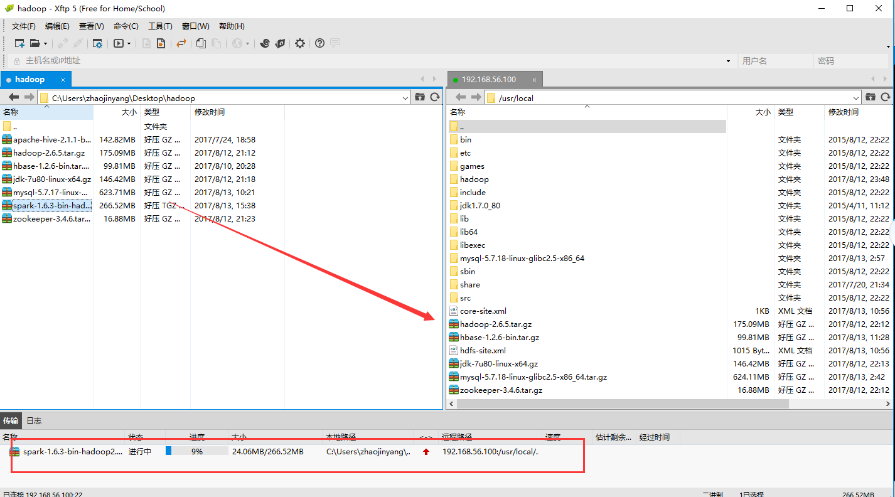

2、配置spark-env.sh文件

```
cd /usr/local/spark/conf

vim spark-env.sh

export JAVA_HOME=/usr/local/jdk1.7.0_80

export HADOOP_HOME=/usr/local/hadoop

export SCALA_HOME=/usr/local/scala

export SPARK_HOME=/usr/local/spark

export PATH=.:$PATH:$JAVA_HOME/bin:$HADOOP_HOME/bin:$HADOOP_HOME/sbin:$HBASE_HOME/bin:$SCALA_HOME/bin

export SPARK_MASTER_IP=192.168.56.100

SPARK_LOCAL_DIRS=/usr/local/spark

SPARK_DRIVER_MEMORY=100M

export SPARK_LIBARY_PATH=.:$JAVA_HOME/lib:$JAVA_HOME/jre/lib:$HADOOP_HOME/lib/native
```

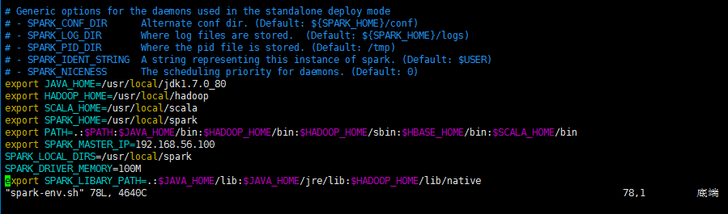

4、配置各个组件的环境变量

```
cd /etc

vim profile

export SPARK_HOME=/usr/local/spark

PATH=.:$PATH:$JAVA_HOME/bin:$HADOOP_HOME/bin:$HADOOP_HOME/sbin:$ZK_HOME/bin:$HBASE_HOME/bin:$HIVE_HOME/bin:$SCALA_HOME/bin:$SQOOP_HOME/bin:$SPARK_HOME/bin:$SPARK_HOME/sbin
```

最后记得重新启动:  

```
. /etc/profile
```

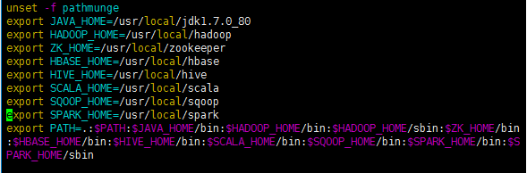

5、将Spark文件夹传送到各个slave节点上

```
cd /usr/local

scp -r spark slave1:/usr/local/

scp -r spark slave2:/usr/local/

scp -r spark slave3:/usr/local/
```

4、从master节点进入到/usr/local/spark/sbin启动Spark

```
cd /usr/local/spark/sbin
```

开启：

```
start-all.sh
```

关闭：

```
stop-all.sh
```

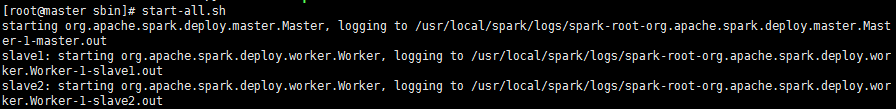


## 二、Intellij开发环境搭建

### 2.1、安装Intellij IDEA

（1）、首先在JDK环境下的主机安装Intellij IDEA


（2）、安装Intellij傻瓜式安装，安装后打开Intellij IDEA


### 2.2、搭建Spark开发环境

（1）、解压spark运行环境

将spark-1.6.3-bin-hadoop2.6解压到E：盘中（可以自己指定）

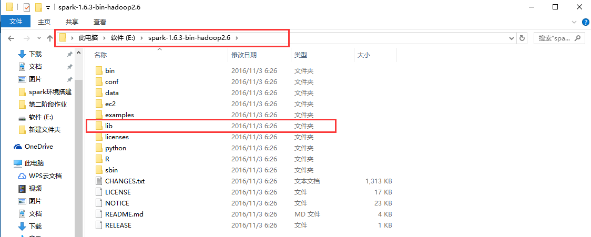

 

（2）、建立新的工程zhaojinyang(/file/new/project)在工程zhaojinyang下file/setting/Plugins中搜索栏搜索scala,查看scala版本，在官网上下载相应插件。

https://plugins.jetbrains.com/plugin/1347-scala

scala-intellij-bin-2017.2.6

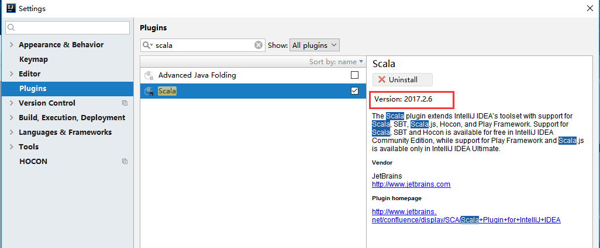

 

（3）、把下载的.zip格式的scala插件放到Intellij IDEA的安装的plugins目录下。

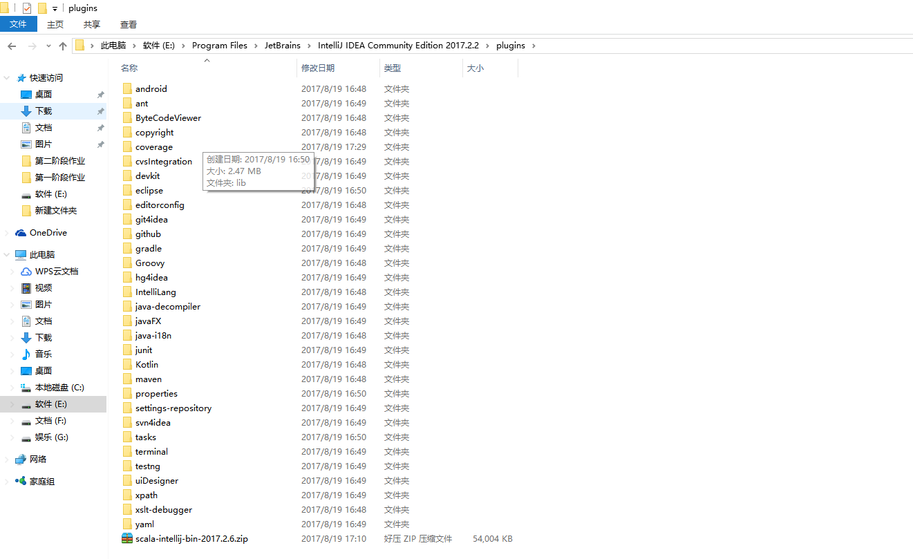

（4）、安装刚刚放到Intellij IDEA的plugins目录下的scala插件（注：直接安装zip文件）

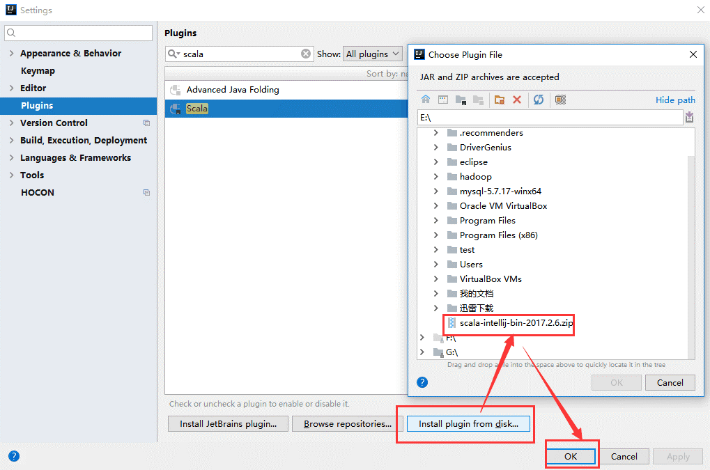

### 2.3、安装Scala插件

（1）、安装scala

下载scala-2.11.0，解压傻瓜式安装。

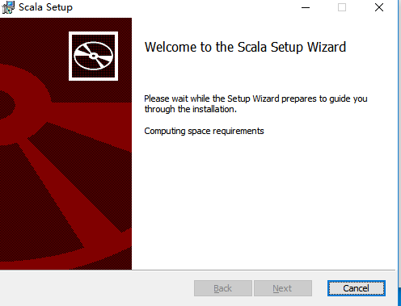

（2）、配置scala环境变量

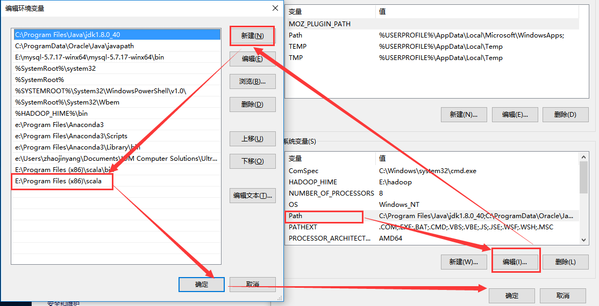

（3）、验证结果

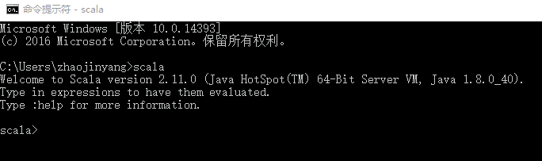

## 三、Spark应用案例编程

### 3.1、wordcound

（1）、新建工程/file/new/project


（2）、填写工程相应的名字、位置、导入相应JDK和Scala环境变量位置

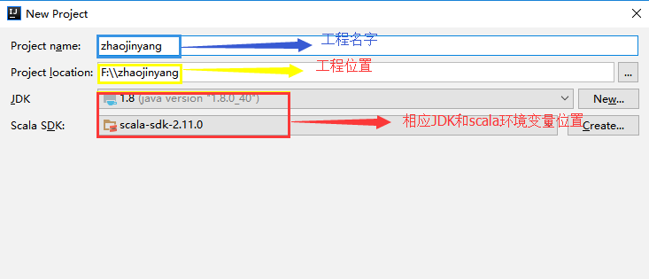

（3）、导入spark的jar包

将spark解压包下lib/spark-assembly-1.6.3-hadoop2.6.0.jar导入中


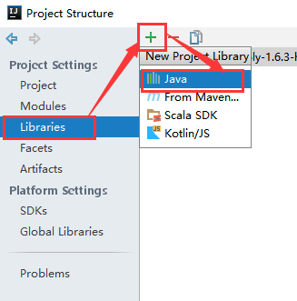

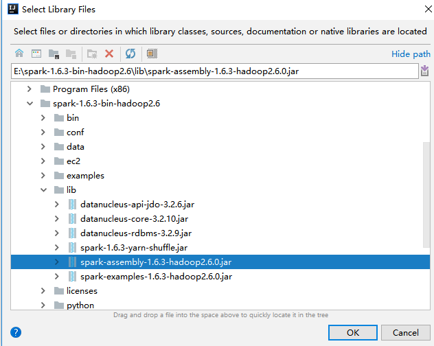

（3）、创建scala程序zhaojinyang/src/new/Scala Class


 

！！！注意命名格式

 

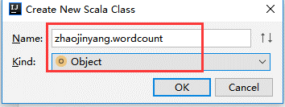


（4）、编写Scala程序

```
package zhaojinyang

import org.apache.spark.SparkConf

import org.apache.spark.SparkContext

object wordcount {

  def main(args: Array[String]) {

    if (args.length < 1) {

      System.err.println("Usage: <file>")

      System.exit(1)

    }

    val conf = new SparkConf()

    val sc = new SparkContext(conf)

    val line = sc.textFile(args(0))

    line.flatMap(_.split(" ")).map((_, 1)).reduceByKey(_+_).collect().foreach(println)

    sc.stop()
  }
}
```

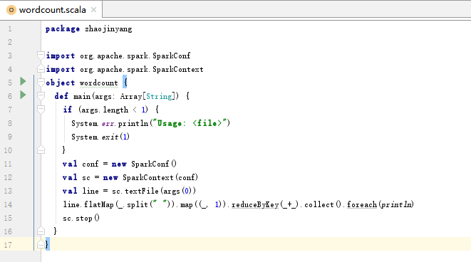

### 3.2、导出wordcound包

（1）、选择File -> Project Structure -> Artifact, 选择‘+’----->Jar---->From Modeles with dependencies ,选择main函数，之后要指定下输出的位置。

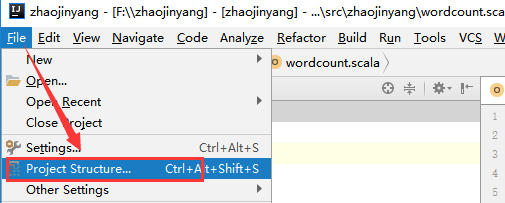

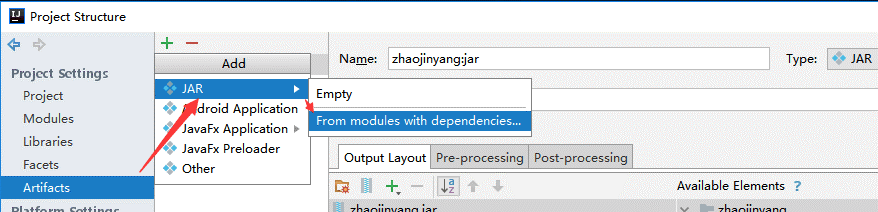

 

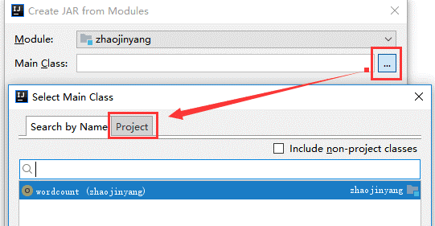

（2）选择Build -> Build Artifacts -> jar包名 -> Build，直到编译器左下角出现completed successfully。

 


 

### 3.3、在hadoop平台下运行wordcound程序

（1）、将zjy.txt文件上传到hadoop中根目录下。


（2）、从master节点进入到/usr/local/spark/sbin启动Spark

```
cd /usr/local/spark/sbin
```

开启：

```
start-all.sh
```

（3）、执行程序

```
spark-submit --master spark://192.168.56.100:7077 --name wordcount --class zhaojinyang.wordcount --executor-memory 500m --total-executor-cores 2 /usr/local/zhaojinyang.jar hdfs://192.168.56.100:9000/zjy.txt
```

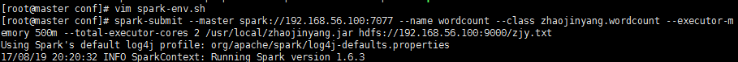

参数解释：

--name  wordcount 表示提交任务名。

--class  zhaojinyang.wordcount 表示执行的方法，带包名。

--executor-memory 500m表示给每个executor指定使用内存。

--total-executor-cores 2 表示所有的executor使用的总CPU核数。

/zhaojinyang.jar 表示jar文件所在的路径。

hdfs://192.168.56.100:9000/cy.txt 表示要进行操作的txt文件在HDFS上的路径。

(4)、运行结果


## 四、错误总结

如果出现内存不足的问题，可能使在spark-env.sh配置文档问题。

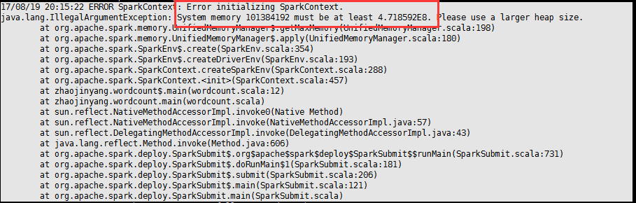

解决办法：

将SPARK_DRIVER_MEMORY修改为1024M

```
SPARK_DRIVER_MEMORY=1024M
```

