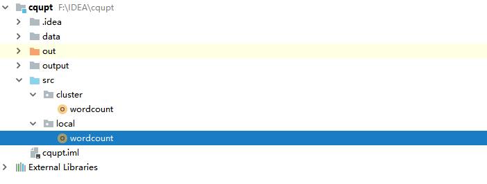
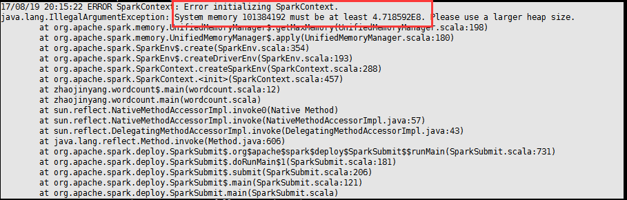

## 一、Spark原理简介

### 1.1、RDD介绍

RDD（弹性数据集）是Spark提供的最重要的抽象的概念，它是一种有容错机制的特殊集合，可以分布在集群的节点上，以函数式编操作集合的方式，进行各种并行操作。可以将RDD理解为一个具有容错机制的特殊集合，它提供了一种只读、只能有已存在的RDD变换而来的共享内存，然后将所有数据都加载到内存中，方便进行多次重用。


1、输入算子：将原生数据转换成RDD，如parallelize、txtFile等

2、转换算子：最主要的算子，是Spark生成DAG图的对象。 
 转换算子并不立即执行，在触发行动算子后再提交给driver处理，生成DAG图 –> Stage –> Task –> Worker执行。 
 按转化算子在DAG图中作用，可以分成两种： 
 窄依赖算子 
 输入输出一对一的算子，且结果RDD的分区结构不变，主要是map、flatMap； 
 输入输出一对一的算子，但结果RDD的分区结构发生了变化，如union、coalesce； 
 从输入中选择部分元素的算子，如filter、distinct、subtract、sample。 
 宽依赖算子 
 宽依赖会涉及shuffle类，在DAG图解析时以此为边界产生Stage。 
 对单个RDD基于key进行重组和reduce，如groupByKey、reduceByKey； 
 对两个RDD基于key进行join和重组，如join、cogroup。

3、缓存算子：对于要多次使用的RDD，可以缓冲加快运行速度，对重要数据可以采用多备份缓存。

4、行动算子：将运算结果RDD转换成原生数据，如count、reduce、collect、saveAsTextFile等。

### 1.2、获取RDD的方法

a.从共享的文件系统获取（如：HDFS）。

b.通过已存在的RDD转换。

c.将已存在scala集合（只要是Seq对象）并行化 ，通过调用SparkContext的parallelize方法实现。

d.改变现有RDD的持久性；RDD是懒散，短暂的。

### 1.3、RDD操作

Transformation：根据数据集创建一个新的数据集，计算后返回一个新RDD。

Actions：对数据集计算后返回一个数值value给驱动程序。


 

#### 1.3.1、Transformation

map 返回一个新的分布式数据集，由每个原元素经过func函数转换后组成

```
val a = sc.parallelize(1 to 9, 3)

val b = a.map(_*2)

a.collect
```


filter(func) 返回一个新的数据集，由经过func函数后返回值为true的原元素组成

```
val a = sc.parallelize(List((1,2),(3,4),(3,6)))

val b = a.filter(_._2 < 3)

b.foreach(println(_))
```


flatMap(func)  类似于map，但是每一个输入元素，会被映射为0到多个输出元素（因此，func函数的返回值是一个Seq，而不是单一元素）

```
val a = sc.parallelize(1 to 4, 2)

val b = a.flatMap(x => 1 to x)

b.collect
```


```
union(otherDataset)
```

返回一个新的数据集，新数据集是由源数据集和参数数据集联合而成。

```
val a = sc.parallelize(List(1,5,6))

val b = sc.parallelize(List(4,5,6))

val c = a.union(b)

c.foreach(println(_))
```


```
groupByKey([numTasks])
```

在一个由（K,V）对组成的数据集上调用，返回一个（K，Seq[V])对的数据集。

```
val a = sc.parallelize(List((1, 1), (1, "B"), (3, "C"), (4, "C")))

val d = a.groupByKey()

d.foreach(println(_))
```


```
reduceByKey(func, [numTasks])
```

在一个（K，V)对的数据集上使用，返回一个（K，V）对的数据集，key相同的值，都被使用指定的reduce函数聚合到一起。和groupbykey类似，任务的个数是可以通过第二个可选参数来配置的。

```
val a = sc.parallelize(List((1,2),(3,4),(3,6)))

a.reduceByKey((x,y) => x + y).collect
```


#### 1.3.2、Actions

```
reduce(func)
```

通过函数func聚集数据集中的所有元素。Func函数接受2个参数，返回一个值。这个函数必须是关联性的，确保可以被正确的并发执行

```
collect()
```

在Driver的程序中，以数组的形式，返回数据集的所有元素。这通常会在使用filter或者其它操作后，返回一个足够小的数据子集再使用，直接将整个RDD集Collect返回，很可能会让Driver程序OOM

count()返回数据集的元素个数

first()返回数据集的第一个元素


```
saveAsTextFile(path) 
```

将数据集的元素，以textfile的形式，保存到本地文件系统，hdfs或者任何其它hadoop支持的文件系统。Spark将会调用每个元素的toString方法，并将它转换为文件中的一行文本

```
val a = sc.parallelize(1 to 10000, 3)

a.saveAsTextFile("mydata_a")
```


查看文件在hdfs的位置，若没有指定就是在当前目录下。


```
foreach(func) 
```

在数据集的每一个元素上，运行函数func。这通常用于更新一个累加器变量，或者和外部存储系统做交互。

```
val a = sc.parallelize(List(1,5,6))

val b = sc.parallelize(List(4,5,6))

val c = a.union(b)

c.foreach(println(_))
```


### 1.4、wordcount实例

1、在/usr/local/目录下传入文件b.txt


2、在/usr/local/spark/sbin目录下进入spark-shell

```
sc.textFile("/usr/local/b.txt").flatMap(_.split(" ")).map((_,1)).reduceByKey(_+_).collect
```


## 二、Intellij开发环境搭建

### 2.1、安装Intellij IDEA

（1）、首先在JDK环境下的主机安装Intellij IDEA


（2）、安装Intellij傻瓜式安装，安装后打开Intellij IDEA


### 2.2、搭建Spark开发环境

（1）、解压spark运行环境

将spark-1.6.3-bin-hadoop2.6解压到E：盘中（可以自己指定）


（2）、建立新的工程zhaojinyang(/file/new/project)在工程zhaojinyang下file/setting/Plugins中搜索栏搜索scala,查看scala版本，在官网上下载相应插件。

https://plugins.jetbrains.com/plugin/1347-scala

scala-intellij-bin-2017.2.6


（3）、把下载的.zip格式的scala插件放到Intellij IDEA的安装的plugins目录下。


（4）、安装刚刚放到Intellij IDEA的plugins目录下的scala插件（注：直接安装zip文件）


### 2.3、安装Scala插件

（1）、安装scala

下载scala-2.11.0，解压傻瓜式安装。


（2）、配置scala环境变量


（3）、验证结果


# 三、Spark应用案例编程



### 3.1、wordcound

（1）、新建工程/file/new/project


（2）、填写工程相应的名字、位置、导入相应JDK和Scala环境变量位置


（3）、导入spark的jar包

将spark解压包下lib/spark-assembly-1.6.3-hadoop2.6.0.jar导入中


#### 3.1.1、local模式

（1）、创建scala程序zhaojinyang/src/new/Scala Class


 

！！！注意命名格式


（2）、创建输入/输出文件


（3）、在本地编写程序

```
package local

import org.apache.spark.SparkContext

object wordcount {

  def main(args: Array[String]) {

    System.setProperty("hadoop.home.dir", "E:\\hadoop")

    val sc = new SparkContext("local","wordcount")

    val rdd = sc.textFile("data/a.txt")

    val counts=rdd.flatMap(_.split(" ")).map((_,1)).reduceByKey(_+_)

    counts.saveAsTextFile("output/wordsOut")

    sc.stop()

  }

}
```


#### 3.1.2、运行测试


#### 3.1.3、cluster模式

（1）、编写Scala程序

```
package cluster

import org.apache.spark.SparkConf

import org.apache.spark.SparkContext

object wordcount {

  def main(args: Array[String]) {

    if (args.length < 1) {

      System.err.println("Usage: <file>")

      System.exit(1)

    }

    val conf = new SparkConf()

    val sc = new SparkContext(conf)

    val line = sc.textFile(args(0))

    line.flatMap(_.split(" ")).map((_, 1)).reduceByKey(_+_).collect().foreach(println)

    sc.stop()

  }

}
 
```


### 3.2、导出wordcound包

（1）、选择File -> Project Structure -> Artifact, 选择‘+’----->Jar---->From Modeles with dependencies ,选择main函数，之后要指定下输出的位置。


 


（2）选择Build -> Build Artifacts -> jar包名 -> Build，直到编译器左下角出现completed successfully。


### 3.3、在hadoop平台下运行wordcound程序

（1）、将zjy.txt文件上传到hadoop中根目录下。


（2）、从master节点进入到/usr/local/spark/sbin启动Spark

```
cd /usr/local/spark/sbin
```

开启：

```
start-all.sh
```

（3）、执行程序

```
spark-submit --master spark://192.168.56.100:7077 --name wordcount --class cluster.wordcount --executor-memory 500m --total-executor-cores 2 /usr/local/cqupt.jar hdfs://192.168.56.100:9000/b.txt
```


参数解释：

--name  wordcount 表示提交任务名。

--class  cluster.wordcount 表示执行的方法，带包名。

--executor-memory 500m表示给每个executor指定使用内存。

--total-executor-cores 2 表示所有的executor使用的总CPU核数。

/cqupt.jar 表示jar文件所在的路径。

hdfs://192.168.56.100:9000/b.txt 表示要进行操作的txt文件在HDFS上的路径。

(4)、运行结果


## 四、错误总结

1、抛出异常：

17/08/28 12:14:18 ERROR Shell: Failed to locate the winutils binary in the hadoop binary path
 java.io.IOException: Could not locate executable null\bin\winutils.exe in the Hadoop binaries.

解决办法

System.setProperty("hadoop.home.dir", "E:\\hadoop");

2、Exception in thread "main" java.lang.NoSuchMethodError: scala.collection.immutable.HashSet$.empty()Lscala/collection/immutable/HashSet;


解决办法：scala-sdk和spark版本不比配问题，下载新的scala，更改scala版本。


 

如果出现内存不足的问题，可能使在spark-env.sh配置文档问题。



解决办法：

将SPARK_DRIVER_MEMORY修改为1024M

```
SPARK_DRIVER_MEMORY=1024M
```


 

 